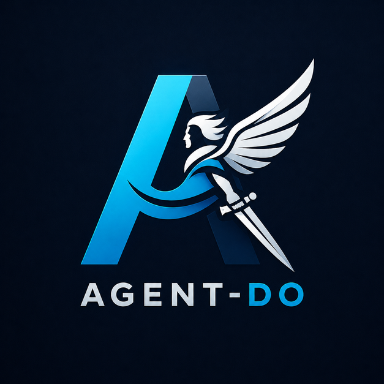

# agent-do

<p align="center">
  
</p>

<p align="center"><strong>The world-facing outer harness for AI coding agents.</strong></p>

AI coding agents are strong inside a repository. They read files, write code, run
tests, and reason through local changes.

The hard part is everything that is not your code: browsers, authentication, cloud
services, databases, screenshots, design review, work tracking, project memory,
PR triage, notifications, and the local machine itself.

`agent-do` gives agents one durable command contract for that outer world:

```bash
agent-do <tool> <command> [args...]
```

One law runs all of it: snapshot before you act, keep receipts. Every tool
declares that law as a machine-readable contract, and the work boards hold it
too: status comes from receipts, never testimony.

It looks like a CLI because the shell is the simplest contract every coding
agent can already use. But it is not primarily a human productivity CLI.

Humans install it, configure credentials, approve local-machine permissions, read
outputs, and occasionally run commands directly for debugging. In normal use, the
caller is the AI agent or its harness. The agent calls `agent-do` to browse,
authenticate, inspect services, review PRs, query data, track work, coordinate
with other agents, and verify results without inventing one-off shell glue.

It is not a replacement for Claude Code, Codex, Cursor, or any other inner agent.
It is the operating layer around them: structured tools, shared credentials,
discoverability, readiness checks, hooks, work boards, and stateful workflows
that make good agent behavior easier to repeat.

## Why It Exists

Agents can improvise. That is useful until the session becomes a pile of custom
curl calls, one-off Playwright scripts, raw vendor CLIs, copied secrets, and
half-remembered setup steps.

`agent-do` narrows that surface.

- One command shape
- One registry of tools, each with a machine-readable safety contract
- One readiness and bootstrap path
- One credential layer
- One discoverability layer
- One work-board grammar
- One hook surface for nudges without hard-blocking work

The goal is not abstraction for its own sake. The goal is repeatable agency:
the agent should be able to inspect the world, act on it, verify the result, and
leave behind enough structure for the next agent to continue.

## Mental Model

Mature `agent-do` tools follow the same rhythm:

```text
Connect -> Snapshot -> Interact -> Verify -> Save
```

Snapshot is the hinge. An agent cannot reason well about a browser page, a
database schema, a cloud service, or an iOS screen unless it can first see the
current state in a structured way.

```bash
agent-do db connect mydb
agent-do db snapshot
agent-do db query "SELECT * FROM orders LIMIT 10"
agent-do db disconnect
```

### Contracts: the safety layer

The rhythm is machine-readable. Every tool declares a `contracts:` block in
`registry.yaml` mapping each command verb to its beats, with `attributes:` flags
(destructive, long_running, polymorphic, composite, sensitive, passthrough) for
the shapes a single beat cannot express. All 96 registered tools declare
contracts; a tool cannot merge without one.

Orchestrators consume the declarations directly:

```bash
agent-do harness contracts surface --json
```

That returns safety buckets (read_only, write, destructive, sensitive,
long_running, passthrough, own_state) as verb lists, answering scheduling
questions mechanically: which commands can run in parallel, which mutate state,
which deserve confirmation before an agent runs them.

Declarations are kept true, not trusted:

```bash
agent-do harness contracts validate   # gate: registry shape + 96/96 coverage, runs in CI
agent-do harness contracts drift      # registry promises vs live tool --help
agent-do harness contracts audit      # behavioral probe of the read surface
```

## Install

```bash
git clone https://github.com/ovachiever/agent-do.git
cd agent-do
./install.sh
```

`agent-do` requires GNU Bash 4.4 or newer. macOS ships Bash 3.2, so install a
current Bash first with `brew install bash`. The launcher finds Homebrew Bash
even when the calling process has a system-only `PATH`, then keeps that same
interpreter available through a Bash-only runtime shim for every dispatched
tool without changing any other command precedence. If no supported Bash
exists, installation and execution stop with an actionable error.
Set `AGENT_DO_BASH=/absolute/path/to/bash` when a supported Bash lives outside
the standard Homebrew, Linuxbrew, Nix, or local-bin paths.

`install.sh` is idempotent. It symlinks `agent-do` into `~/.local/bin`, writes
an install-path breadcrumb under `~/.agent-do/`, generates the discovery index
from `registry.yaml`, installs Python dependencies, offers optional npm and
cargo builds for the browser and board tools, and runs a health check.

Hooks install as thin wrappers that delegate into the repo, so `git pull`
updates hook behavior without re-running the installer. Claude Code hooks always
install; Codex hooks install when `~/.codex/` exists (`--codex` forces,
`--no-codex` skips). The installer prints the settings.json registration snippet
and never edits your settings itself. `./install.sh --uninstall` removes the
symlink and the wrappers.

See [docs/INTEGRATION.md](docs/INTEGRATION.md) for hook registration and behavior.

## First Run

```bash
agent-do --health
agent-do bootstrap --recommend
agent-do bootstrap
```

`--health` checks whether the harness is usable. `bootstrap --recommend` shows
which stateful tools should be initialized for the current machine or
repository. Every detected project gets the paired work-state scaffold:
`.manna/` for the board and tracked `.handoff/` files for executable work
orders. `bootstrap` initializes the pieces that are actually needed.

## Finding The Right Tool

When the agent knows the tool:

```bash
agent-do <tool> <command> [args...]
```

When the agent knows the goal but not the tool:

```bash
agent-do --list                          # full registered inventory
agent-do find playwright                 # keyword search across the registry
agent-do suggest "check render logs"     # task to likely tool and command
agent-do suggest --project               # likely tools for this repository
```

When a human or harness wants natural-language routing:

```bash
agent-do -n "take an iOS screenshot"        # LLM-routed
agent-do --offline "check render logs"      # pattern-matched, no API key
agent-do --how "review PRs waiting for me"  # explain the route, then run it
```

Natural-language and offline routing use three exit codes: `0` success, `1`
error, `2` needs clarification. An orchestrator that sees `2` should ask a
follow-up and retry with `--context`.

## Work Boards

`agent-do manna` is git-backed issue tracking built for agents. Session claims
prevent two agents from working the same issue. `.manna/` is the only backlog,
and `.handoff/` holds one portable work order for each actionable item.

Every issue is a **track** (a named grouping with intent), an **item** on a
track, or a **dream** (raw intake, exempt from tracking, converted or closed
with a written reason). Commits that advance an item cite it with a
`Manna: mn-xxxxxx` trailer. The board is the only backlog.

```bash
agent-do manna init
agent-do manna migrate   # once, for an existing legacy board
agent-do manna create "Fix auth redirect" --type item --track mn-a1b2c3 \
  --source "docs/auth-audit.md"
agent-do manna handoff seal mn-d4e5f6   # after intentional handoff edits
agent-do manna claim mn-d4e5f6
agent-do manna done mn-d4e5f6
```

Beyond title and status, issues carry five schema fields: `type` (track, item,
dream), `track` (the parent track), `source` (where the work came from), and
`prompt` (the repository-relative `.handoff/` work order paired with the item),
plus `handoff_digest` (the board-side SHA-256 binding over the canonical handoff,
with its binding field normalized). Claimed rows also carry a digest of the
session's private bearer token; the visible `claimed_by` label is not authority.
On a strict board, `create` writes an HMAC-authenticated recoverable row/file
transaction. Journal installation is atomic no-clobber, the signature includes
the canonical project root, replay compares the complete board row, and
recovery accepts only canonical `.handoff/` targets.
`claim` validates and
changes state under one board lock, so concurrent sessions have exactly one
winner. It refuses missing, ignored, symlink-escaped, structurally invalid, or
unsealed handoffs.

`manna init` pins strict or legacy identity in `.manna/board.yaml`, then
installs workflow version 2 and `.handoff/README.md` for strict boards. If a
repository ignores `.manna/` or `.handoff/`, init adds
the narrow unignore rules needed to keep workflow state in Git while leaving
the runtime lock and transaction journal ignored. Removing `workflow.yaml`
cannot disable strict validation; init restores it. Pre-workflow nonempty
boards are classified explicitly as legacy and are not rearranged.
`manna migrate` performs that rearrangement only when explicitly requested. A
single authenticated whole-board journal creates sealed pairs for active
items, grandfathers done history, exempts tracks and dreams, releases legacy
claims without ownership proofs, and publishes strict identity last. The
operation is crash-recoverable and idempotent; normal strict writes keep every
Stage 0 fail-closed check.
Restoration and ordinary metadata updates never recalculate a handoff seal;
only `handoff seal` can authorize edited contents.

Raw ideas enter through `dream`, which files the spark on the nearest board up
the directory tree, or the global inbox when no board exists:

```bash
agent-do manna dream "Cache the registry parse" --source "profiling session"
```

Two commands keep the board honest:

```bash
agent-do manna lint              # board grammar check; findings exit 1
agent-do manna reconcile         # drift between the board and reality
agent-do manna reconcile --fix   # safe fixes: abandon dead claims,
                                 # unblock resolved blockers
```

`reconcile` is receipts over testimony: it reads git history for `Manna:`
trailers, probes whether claiming sessions are still alive, and checks blockers
against actual state instead of trusting what the board says about itself. On
strict boards it also detects active claim commands or prompt pointers living
in any claim-bearing Markdown outside `.handoff/`, including neutral or
symlinked roots, plus orphan files under `.handoff/`. Those
workflow-integrity findings exit 1; informational drift stays advisory.

## The Ambient Loop

With the Claude Code hooks installed, board-driven work needs no ceremony:

- **SessionStart** pins the session identity (`AGENT_DO_COORD_SESSION`,
  `MANNA_SESSION_ID`, `MANNA_SESSION_TOKEN`) so coordination presence and board
  claims survive pid recycling without making the public owner label a
  credential, then injects the current board into context. If the previous
  session left unresolved drift, the greeting includes it.
- **SessionEnd** retires coordination presence and runs a bounded
  `manna reconcile --write-drift` advisory, leaving findings in
  `.manna/drift.yaml` for the next session's greeting.

Everything is presence-gated: repositories without a `.manna/` board see none
of it. Codex, whose SessionStart channel cannot persist environment exports,
derives the same stable ownership proof from its opaque thread id and a
machine-local key outside the repository.

The wider hook model stays non-blocking by design: hooks suggest relevant tools
at session start, route fuzzy user prompts to likely `agent-do` commands,
surface coordination context when another agent is active in the same project,
and record outcome telemetry so nudges can be measured instead of guessed. No
hook hard-blocks work.

## Multi-Agent Coordination

```bash
agent-do coord touch
agent-do coord peers
agent-do coord focus set "private Render networking" --path render.yaml --phase building
agent-do coord claim render.yaml --reason "blueprint wiring"
agent-do coord interrupts
```

`coord` is a shared state board, not an agent chat system. Presence is
liveness-verified: a dead session can never read as an active peer. Agents
declare roles (builder, auditor, researcher, overseer) with exclusive-writer
territories, place advisory claims on paths, publish artifacts, drop file
pointers for each other, and read contention, notice, dependency, and novelty
interrupts derived from all of it. A warn-only pre-commit guard
(`agent-do coord guard install`) flags commits that touch another agent's live
claims.

## Memory

Two memory systems with a clean division of labor:

| | `context` | `zpc` |
|---|---|---|
| Holds | External reference docs | Lessons and decisions from real work |
| Question it answers | What do the docs say? | What did we learn using them? |
| Scope | Global (`~/.agent-do/context/`) | Per-project (`.zpc/`) |
| Typical calls | `context retrieve`, `context fetch-llms` | `zpc learn`, `zpc decide`, `zpc patterns` |

## Internal Model Roles

Tools that need an LLM internally resolve it by role (fast, vision, deep)
through `models.yaml` instead of hard-coding model IDs. `agent-do models
resolve <role>` returns the current provider and model, and `agent-do models
doctor` verifies the configured lists.

## Credentials

```bash
agent-do creds required render            # what a tool needs
agent-do creds store RENDER_API_KEY --stdin
agent-do creds check --tool render
```

`creds required` is the public setup contract for every tool: required keys,
optional keys, and feature-specific notes when a tool can run partially without
a key. The dispatcher, router, and health checker resolve declared tool secrets
from the secure store automatically, so secrets never appear in command
arguments, shell history, or docs.

## Tool Tour

96 registered tools. The flagships:

| Tool | What it does |
|---|---|
| `browse` | Headless browser with @ref element selection, SSO/MFA login handoff into headless state, persistent auth sessions, API capture and replay |
| `auth` | Site-level auth orchestration: probes the live checkpoint, advances one safe step at a time, ensures authenticated state through a strategy ladder |
| `manna` | Git-backed work boards: tracks, items, dreams, claims, lint, reconcile |
| `coord` | Shared state board for parallel agents: presence, roles, territories, claims, interrupts |
| `gh` | GitHub PR work-state: inbox, review, unresolved threads, checks, audit with deploy probes |
| `db` | Database client for PostgreSQL, MySQL, SQLite: connect, snapshot schema, query |
| `excel` | Workbook automation: read and write cells, formulas, sheets |
| `dpt` | Design Perception Tensor: 72-rule visual quality scoring of the live page, 0-100 |

The rest of the catalog covers cloud platforms (`render`, `vercel`, `supabase`,
`cloudflare`, `gcp`, `docker`, `k8s`), identity providers (`clerk`, `okta`),
domains and email infrastructure (`namecheap`, `dns`, `resend`), devices and
desktops (`ios`, `android`, `macos`, `screen`, `hardware`), perception
(`vision`, `ocr`, `image`, `video`, `audio`), documents and data (`sheets`,
`pdf`, `pdf2md`, `jupyter`), knowledge surfaces (`obsidian`, `notion`,
`calendar`), and communication (`email`, `sms`, `slack`, `meetings`), plus a
root `notify` contract that routes one message across providers.

See [docs/TOOLS.md](docs/TOOLS.md) for the full map, and
`agent-do <tool> --help` for command details.

### Browser automation

```bash
agent-do browse open https://app.example.com
agent-do browse snapshot -i
agent-do browse fill @e3 "admin@example.com"
agent-do browse click @e7
agent-do browse wait --stable
```

For authenticated sessions:

```bash
agent-do browse login https://app.example.com   # headed window for SSO/MFA
agent-do browse login done --save mysite        # transfer auth to headless
agent-do browse session load mysite             # instant auth next session
```

### GitHub review work

```bash
agent-do gh inbox
agent-do gh audit owner/repo#123 --reply --probe-deploys
```

`gh audit` inspects PR metadata, checks, unresolved threads, changed files,
diff content, lockfile blast radius, and deployment hints, and can draft
engineering review text with concrete fix guidance.

### Visual QA

```bash
agent-do browse open http://localhost:7847
agent-do dpt score          # scores the page open in the browse daemon
agent-do dpt violations     # fix list sorted by impact
```

### Live desktop control

Commands that drive the visible desktop or a real browser window require an
explicit runtime modifier, scoped and time-bounded:

```bash
agent-do +live(scope=desktop,ttl=15m) macos click @g5
```

## Architecture

At runtime, the core is plain:

```text
agent-do <tool> <command>
        |
        v
tools/agent-<name>
```

The supporting layers are:

- `registry.yaml` for tool metadata, routing hints, and contracts
- `models.yaml` for internal model roles
- `tools/` for tool implementations
- `lib/` for shared helpers
- `hooks/claude/` and `hooks/codex/` for harness integration
- `bin/` for routing, health, bootstrap, and discovery

See [ARCHITECTURE.md](ARCHITECTURE.md) for the full system map.

## Requirements

- GNU Bash 4.4+
- Python 3.10+
- Node.js 18+ for browser tooling
- Rust for `manna`
- `tmux` for terminal-session tooling
- Optional API keys for providers you want to use

Install Python dependencies with:

```bash
pip install -r requirements.txt
```

## Security

Do not put secrets in repos, logs, screenshots, or review comments. Use
`agent-do creds` for API keys and tokens; declared secrets resolve from the
secure store at execution time.

`agent-do context` fetches public reference material without browser cookies or
saved auth state. HTML sources are cached locally with raw provenance plus
extracted searchable text. Agent-facing context output redacts common token,
key, secret, signature, password, auth, and credential query parameters.

See [SECURITY.md](SECURITY.md) for vulnerability reporting.

## Development

Run the root smoke suite:

```bash
./test.sh
```

Selected deeper checks:

```bash
cd tools/agent-browse && npm test
cd tools/agent-manna && cargo test
bash tools/agent-context/test/integration.sh
bash tools/agent-manna/test/integration.sh
```

Contribution guidance lives in [CONTRIBUTING.md](CONTRIBUTING.md).

## License

MIT. See [LICENSE](LICENSE).
